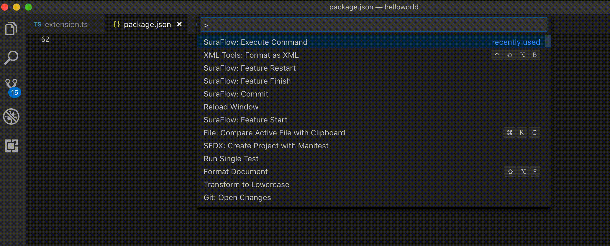

# SuraFlow - Salesforce

El flujo de trabajo de Sura con Salesforce se basa en `Gitflow` (https://danielkummer.github.io/git-flow-cheatsheet/).
Sin embargo se realizaron algunas modificaciones al proceso para que se adpate mejor a la forma de trabajo con Salesforce y se construyeron scripts y esta extensión de VSCODE que facilitan el trabajo y evitan tener que ejecutar comandos en el shell.
En este flujo existen 3 momentos:

* Iniciar el Feature Branch.
* Realizar Commit a medida que se trabaja.
* Finalizar el Feature Branch.

## Manual de Uso
### Iniciar el Feature Branch
Presionar `Ctrl + Shift + P` y seleccionar el comando: `SuraFlow: Feature Start`.

Se abre un campo de text para ingresar el nombre del feature branch, cuando lo digite presione `Enter`.

### Realizar Commit 
Presionar `Ctrl + Shift + P` y seleccionar el comando: `SuraFlow: Feature Commit`.

Se abre un campo de text para ingresar el mensaje para el commit, cuando lo digite presione `Enter`.

> ¿Cada cuanto debo hacer commit?
> Tan frecuentemente como se pueda, pero al menos una vez al día.  De esta manera se asegura que los cambios estén constantemente protegidos en el servidor remoto de GIT.

### Finalizar el Feature Branch
Presionar `Ctrl + Shift + P` y seleccionar el comando: `SuraFlow: Feature Finish`.

Se abre un campo de text para ingresar el mensaje para el commit final del feature branch, cuando lo digite presione `Enter`.

## Release Notes

Estos son los release notes de la extensión suraFlow

### 1.0.0

Initial release of suraFlow, construcción de la extensión de VSCODE con los siguientes comandos:
* SuraFlow: Execute Command
* SuraFlow: Feature Start
* SuraFlow: Feature Commit
* SuraFlow: Feature Finish
* SuraFlow: Feature Restart

